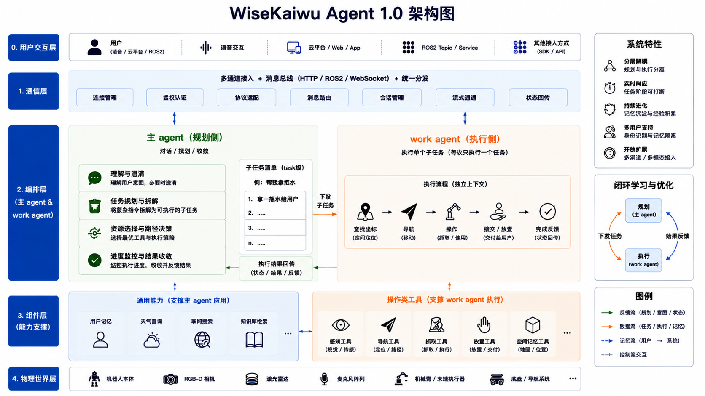

# Wisekaiwu Agent SDK - 开发者使用指南

慧思开物（Wisekaiwu）是由北京人形机器人创新中心发布的通用具身智能平台，主打 **“一脑多能、一脑多机”**：同一套软件系统可在机械臂、轮式机器人、人形机器人等多构型本体上运行，并适配工业制造、医疗护理、家庭服务等不同场景，无需为每个场景重复开发底层系统。详见公众号文章 [慧思开物](https://mp.weixin.qq.com/s/ZddsbS8odvLRDpoqK3GSnA)。

平台采用 **“大脑—小脑”** 架构，形成任务闭环：

- **具身“大脑”**：由 AI 大模型驱动的任务规划中枢，负责自然交互、空间感知、意图理解、分层规划与错误反思。
- **具身“小脑”**：数据驱动的执行层，包含元技能库与运控能力，负责把大脑的规划落地为具体动作，并将执行反馈回传。
- **闭环流程**：“任务理解 → 规划 → 执行 → 反馈”，由大脑规划、调用小脑技能执行、再将结果反馈回大脑。

平台面向开发者提供四类能力：App 控制、云平台管理、机器人大脑（即 Wisekaiwu Agent SDK）、机器人小脑（具身技能与具身运控）。

**Wisekaiwu Agent SDK** 用于开发机器人的大脑，能够接收来自语音终端、慧思开物云平台或机器人系统的指令，由大模型进行意图理解与任务规划，再通过SKILL和工具服务调度小脑技能执行导航、抓取等动作，并将执行状态反馈回大脑，形成 **“指令接入 → 任务规划 → 工具执行 → 状态反馈”** 的推理闭环。



> **⚠️ 使用授权提示**
> Wisekaiwu Agent SDK 由北京人形机器人创新中心研发，非开源项目，目前仅对授权客户在内部组织进行试用。授权客户有责任进行用户管控：
> - 严禁分发、传递给非授权用户
> - 严禁上传至 GitHub、网盘等任何可能造成信息或代码泄露的公共渠道

## 关于本指南

本手册聚焦 Wisekaiwu Agent SDK（机器人大脑）的部署、安装、跑通验证与二次开发，目标是帮助使用方快速把大脑服务在目标机上跑起来并上手使用。

- **适用对象**：拿到发布包进行部署、二次开发的使用方。
- **运行环境**：Ubuntu 22.04 系统，支持 x86_64 与 arm64（含 Jetson AGX Orin、Jetson Orin NX、Jetson Orin Nano）架构（详见 [1.2 系统要求](#12-系统要求)）。

## 目录

1. [开始之前](#1-开始之前)
2. [环境准备](#2-环境准备)
3. [安装](#3-安装)
4. [快速开始](#4-快速开始)
   - [4.1 初始化配置](#41-初始化配置)
   - [4.2 启动服务](#42-启动服务)
5. [配置与二次开发](#5-配置与二次开发)
6. [个性化记忆配置](#6-个性化记忆配置)
7. [真机部署注意点](#7-真机部署注意点)

---

## 1. 开始之前

### 1.1 获取部署 SDK

完整部署包内含机器人大脑（kaiwu-agent）、语音终端（robot_voice）、算法组件（algo_tools）三大模块。本手册以 kaiwu-agent（机器人大脑）的部署与使用为主线，手把手带你完成从环境准备、依赖安装、配置到启动的全过程，并教你如何在机器人上把 agent 部署、调试并稳定运行起来。

部署包目录结构：

```
wisekaiwu_agent/
├── select_agent_and_voice.sh    # 按系统架构自动启用正确的 .so（agent + voice）
├── README.md                    # 总览说明
├── LICENSE / notice.md          # 许可与声明
├── kaiwu-agent/                 # 机器人大脑（核心模块）
│   ├── kaiwu_x86_64.so          #   核心模块，x86_64 机器选用
│   ├── kaiwu_arm64.so           #   核心模块，arm64 机器选用
│   ├── main.py                  #   启动入口
│   ├── requirements.txt         #   Python 依赖清单
│   ├── .example.env             #   环境变量模板（含外部服务 API Key 占位）
│   ├── configs/                 #   运行配置
│   │   ├── kaiwu.yaml           #     主配置：机器人身份、通道、工具、个性化
│   │   ├── model.yaml           #     模型服务配置
│   │   └── references/          #     知识库引用（产品资料、地图数据等）
│   ├── skills/                  #   技能定义目录（SKILL.md）
│   ├── testbench/               #   本地验证工具（mock MCP / mock 云平台）
├── robot_voice/                 # 语音交互终端（语音输入 / TTS 播报）
│   ├── robot_voice_x86_64.so    #   x86_64 架构模块（二选一启用）
│   ├── robot_voice_arm64.so     #   arm64 架构模块（二选一启用）
│   ├── fake_server.py           #   命令行模拟语音输入（无需麦克风）
│   ├── server*.py               #   多种启动方式（ROS1 / ROS2 / 仅 TTS 等）
│   ├── configs/                 #   语音服务配置
│   ├── requirements.txt         #   Python 依赖清单
│   └── docs/                    #   语音模块文档
└── algo_tools/                  # 算法公共组件
    ├── algo_tools.tar.gz        #   pip 安装包
    ├── docs/                    #   文档
    └── examples/                #   使用示例
```

### 1.2 系统要求

| 项目 | 要求 | 说明 |
|------|------|------|
| 操作系统 | Ubuntu 22.04 / 24.04 LTS | x86_64 或 arm64 均可；推荐 22.04 LTS（Jammy）或 24.04 LTS（Noble） |
| 硬件 | ≥ 4 核 ≥ 1.0 GHz，≥ 8 GB 内存，≥ 10 GB 磁盘 | 推荐 16 GB 以上内存；Jetson Orin 系列或同规格 x86_64 处理器 |
| Python | 3.10（推荐） | 当前编译 .so 文件基于 Python 3.10 编译，如需其他版本请联系对接人重新编译 |
| 网络 | 可访问外网 | 安装依赖、调用联网工具、连接模型服务 |
| 大模型服务 | OpenAI 兼容模型服务 | 我方提供或你自备，配置见 [4.1.2](#412-配置模型服务modelyaml) |

---

## 2. 环境准备

本章在目标机上准备运行环境。每步执行后请核对 ✅ 验证 结果。

### 2.1 安装系统依赖

核心模块依赖 OpenCV 等库，需要安装以下系统包：

```bash
sudo apt-get update
sudo apt-get install -y python3.10 libgl1 libglib2.0-0
```

- `libgl1` / `libglib2.0-0`：OpenCV 运行所需系统库（缺失会报 `libGL.so.1` / `libgthread-2.0.so.0 not found`）。

### 2.2 Python 环境

核心模块（.so 文件）是用 Python 3.10 编译的，需要 Python 3.10 运行。Ubuntu 22.04 默认自带 Python 3.10：

```bash
python --version   # 检查 python 版本
```

### 2.3 安装 uv

本手册用 uv 管理虚拟环境与依赖（速度快，且能锁定 Python 版本）：

```bash
curl -LsSf https://astral.sh/uv/install.sh | sh
source ~/.bashrc        # 或重开一个终端，让 uv 进入 PATH
uv --version            # 能输出 uv 0.x.x 即安装成功
```

> ⚠️ 若提示 `uv: command not found`：执行 `source ~/.bashrc` 或重开终端；仍无效则手动把 `~/.local/bin` 加入 PATH。

---

## 3. 安装

robot_voice 和 kaiwu-agent 都在部署包中，是 `wisekaiwu_agent/` 的子目录。按本手册顺序：先装语音终端 robot_voice（可选），再装 kaiwu-agent。

> 不需要语音交互？可跳过 3.2–3.4，直接安装 kaiwu-agent（[3.3](#33-安装-kaiwu-agent)），用 huisikaiwu 通道做跑通验证（[4.2.2 慧思开物 APP 交互](#422-慧思开物-app-交互)）。

### 3.1 选择编译包

进入wisekaiwu_agent，执行 `select_agent_and_voice.sh` 根据系统架构选择对应的编译包。

```bash
# 进入 wisekaiwu_agent 目录
cd wisekaiwu_agent

# 脚本会识别当前架构，将匹配的 kaiwu_{arm64,x86_64}.so 和 robot_voice_{arm64,x86_64}.so
# 分别链接/重命名为 kaiwu.so 和 robot_voice.so 供程序导入
bash select_agent_and_voice.sh
```

### 3.2 安装语音终端

#### 3.2.1 天轶 2.0 机器及之前的机器

选用 robot_voice 语音终端。robot_voice 是独立交付的语音终端包，基于讯飞语音套件，负责语音识别（ASR）、语音合成（TTS）与播报：把语音/文本输入送给 kaiwu-agent，再把回复播报出来。详细参考：`robot_voice/docs/user_guide.md`。

```bash
# 从 huisikaiwu 目录进入语音模块，创建并激活虚拟环境
cd robot_voice
uv venv --python 3.10
source .venv/bin/activate

# 安装依赖
uv pip install -r requirements.txt
```

**启动语音 ROS 环境**

仅真机语音需要；用 `fake_server.py` 做命令行模拟语音交互测试可跳过本节。

讯飞 ROS 节点一般开机自启，正常时无需手动启动。仅当下面的检查发现节点缺失时，再手动启动：

```bash
# 不同机器的 ros 目录可能不同，请以机器人本体用户文档为准
source /home/${USER}/audio_ws/devel/setup.bash && roslaunch xunfei_dev_socket xunfei_dev_all.launch
# 看到 recive handshake msg 即成功；全局只能有一个语音 ros 窗口（互斥）
```

✅ 检查 ROS 节点：

```bash
ros2 topic list | grep aiui          # 如果看到 /xunfei/aiui_msg 表示节点正常
ros2 topic echo /xunfei/aiui_msg     # 检查 /xunfei/aiui_msg 消息节点是否正常工作，正常状态下对话时有消息输出即正常
```

> ⚠️ 排错：节点列表里没有讯飞节点，多半是 `ROS_DOMAIN_ID` 被改过（讯飞默认向 id=0 发送）：
>
> ```bash
> echo $ROS_DOMAIN_ID        # 查看当前 domain_id
> export ROS_DOMAIN_ID=0     # 仅对当前终端生效，不影响全局
> ```

**启动语音服务**

> 启动前请确认已在 `robot_voice` 目录并激活其虚拟环境（`cd robot_voice && source .venv/bin/activate`）。

按机器人环境选用其中一种：

```bash
# ROS1 语音服务（暂不支持，请联系我们解决）
python server.py

# ROS2 语音服务
python server_event.py

# 仅 TTS（不做语音识别）
python server_tts_without_ros.py

# 无 ROS / 无麦克风，命令行测试
python fake_server.py
```

> ⚠️ 若启动报缺少 robot_voice 模块：确认已在 huisikaiwu 根目录执行过 `bash select_agent_and_voice.sh`。

#### 3.2.2 天工 3.0
天工 3.0 默认启用 ROS语音，天轶2.0及以前的机器人还在用 robot_voice，后续会逐步过渡到 ROS。[ros语音](https://zitd5je6f7j.feishu.cn/wiki/DiYewtlOFiwXEYkbMEsch4GBnvh)。

> 注意：kaiwu-agent 暂还没有通过 ROS 进行语音交互完成验证，目前只是理论上支持。后续会验证，如果有着急的需求，请联系我们。

#### 3.2.3 其他机器

需要自行开发语音交互终端，通过 WebSocket 或者 ROS 与 Agent 交互。

> 注意：暂还不支持二次开发的语音交互终端接入，后续将支持，如果有着急的需求，请联系我们。

### 3.3 安装 kaiwu-agent

kaiwu-agent 与 robot_voice 同在 `wisekaiwu_agent` 中。

```bash
# 进入 wisekaiwu_agent 目录
cd wisekaiwu_agent

# 从 huisikaiwu 目录进入 agent 模块，创建并激活虚拟环境
cd kaiwu-agent
uv venv --python 3.10
source .venv/bin/activate

# 安装依赖
uv pip install -r requirements.txt
```

> ⚠️ 排错：
> - **安装很慢/超时**：可换国内镜像，例如 `uv pip install -r requirements.txt --index-url https://pypi.tuna.tsinghua.edu.cn/simple`。
> - **报缺少编译工具**：执行 `sudo apt-get install -y build-essential`。
> - **启动时出现`import kaiwu` 失败 / ELF 架构不匹配**：架构选择未生效，在 huisikaiwu 根目录重新执行 `bash select_agent_and_voice.sh`。

至此运行环境就绪。

---

## 4. 快速开始

完成安装后，按本章两步即可把大脑服务跑起来：先做一次性的初始化配置，再按依赖顺序启动服务。

### 4.1 初始化配置

启动服务前，先做一次性配置。所有配置都在 `kaiwu-agent/` 目录下，涉及三个文件：

| 文件 | 作用 | 是否必配 |
|------|------|----------|
| `.env` | 外部服务 Key（联网搜索、天气等） | 按需，不用可留空 |
| `configs/model.yaml` | 大模型服务地址与密钥 | 必配 |
| `configs/kaiwu.yaml` | 交互通道、MCP 工具等 | 至少开启一个 Channel |

最小可运行只需：配好模型（[4.1.2](#412-配置模型服务modelyaml)）+ 开启一个交互通道（[4.1.3](#413-配置主配置文件kaiwuyaml)），默认已 `cd kaiwu-agent` 并激活虚拟环境（`source .venv/bin/activate`）。

#### 4.1.1 配置环境变量（.env）

从模板复制一份：

```bash
cp .example.env .env
```

`.env` 中存放服务或数据库连接的 Key，按需填写，未使用的功能可留空：

| 服务 | 用途 | 关键配置项 |
|------|------|------------|
| 博查搜索 | 联网搜索 | `BOCHA_API_KEY` |
| 和风天气 | 天气查询 | `HEFENG_API_KEY` |
| 百度千帆 | RAG 知识库 / 个性化 | `BAIDU_QIANFAN_ACCESS_TOKEN` |
| 百度人脸 | 个性化记忆-人脸识别 | `BAIDU_FACE_API_KEY` |
| IP 地理位置 | 位置查询 | `IPGEO_API_KEY` |
| DBVector | 个性化记忆-向量存储 | `DBVECTOR_*` |
| RDS | 个性化记忆-关系数据 | `RDS_*` |
| BOS | 个性化记忆-对象存储 | `BOS_*` |

> ⚠️ 安全提示：`.example.env` 里预填的 Key 仅为占位/示例，不要用于生产。用到联网类功能时，请替换成你自己申请的 Key。

#### 4.1.2 配置模型服务（model.yaml）

`configs/model.yaml` 定义一个或多个模型服务，默认使用 `pelican-thinking`：

```yaml
model_servers:
  pelican-thinking:                 # 服务名（可用 --model-server 切换）
    model: <模型名>
    api_key: <key 或 EMPTY>
    base_url: <OpenAI 兼容地址>/v1
```

#### 4.1.3 配置主配置文件（kaiwu.yaml）

`configs/kaiwu.yaml` 是 agent 的核心配置，下面按必须配置和可选/默认即可两类说明。

##### 必须配置

**1. 交互通道（`gateway.channels`）**

交互通道是 agent 与外部世界收发消息的接口。每个通道对应一种接入方式，负责把外部指令（语音、HTTP、ROS 话题等）转为 agent 统一的内部消息，再把 agent 的回复按对应协议送回。通道通过 `enable_input` / `enable_output` 独立控制收、发，可同时开启多个。目前默认支持三个交互通道，至少开启一个通道 agent 才能接收用户指令：

| 场景 | 开启的通道 | 关键配置 |
|------|-----------|----------|
| 语音交互 | `voice_socket` | `enable_input/output: true`，`extra.uri` 指向 robot_voice 服务 |
| 云平台对接 | `huisikaiwu` | `enable_input/output: true` |
| ros语音 | `ros2` | `enable_input/output: true` |

示例——开启语音通道：

```yaml
gateway:
  channels:
    voice_socket: 
      enable_input: true     # ← 改为 true
      enable_output: true    # ← 改为 true
      stream: true
      extra:
        uri: ws://<robot_voice地址>:<端口>
        voice_path: "/voice"
        tts_path: "/ttsplay"
```

**2. MCP 工具服务（`mcp_cfg`）**

kaiwu agent 通过 MCP 协议调用具身操作工具（移动、抓取、放置等），MCP 服务端暴露一组工具，kaiwu agent 在启动时自动发现并注册这些工具，推理过程中按需调用。

具身操作 `mcp_cfg` 配置在 `work_graph_creator`（执行物理动作的 work agent）下。默认配置指向本地 mock（仅用于本地开发调试）：

```yaml
work_graph_creator:
  # ...
  mcp_cfg:
    robot_actions:                        # 服务名（可自定义，真机需替换成可实际执行机器人操作的mcp服务）
      url: http://localhost:8000/mcp      # MCP 服务端地址
      transport: streamable_http          # 传输协议
      sse_read_timeout: 1800              # SSE 读超时（秒）
    ...                                   # 支持配置多个 MCP 服务
```

根据你的场景选择配置方式：

- **方式 A：本地 mock（开发验证）** —— 保持默认的 `url: http://localhost:8000/mcp`，启动时需先在另一终端运行 mock（见 [4.2.1](#421-机器人语音交互部署)）。
- **方式 B：真机部署** —— 将 `url` 改为真实机器人操作服务地址：

  ```yaml
  mcp_cfg:
    mcp_server_name:                      # 配置成真实操作的mcp服务
      url: http://<真机IP>:<端口>/mcp   
      transport: streamable_http
      sse_read_timeout: 1800
  ```

- **方式 C：不需要动作类指令** —— 注释掉整段 `mcp_cfg`，此时 agent 仅能处理对话类（chat）指令：

  ```yaml
  # mcp_cfg:
  #   robot_actions:
  #     url: http://localhost:8000/mcp
  #     ...
  ```

##### 默认即可（按需调整）

| 配置段 | 作用 | 何时需改 |
|--------|------|----------|
| `robot_identity` | 机器人名称、角色描述、谐音矫正 | 需要自定义机器人人设时 |
| `skills` | 技能总开关与禁用列表 | 禁用某技能时填 `disabled_skills` |
| `model` | LLM 模型参数，主/work agent 共用 | 一般不改，由 model.yaml 注入 |
| `main_graph_creator` | 主 agent | 调整对话行为、增删 chat 类工具时 |
| `work_graph_creator` | work agent，主 agent 通过工具调用 | 调整动作执行行为、切换 MCP 服务时 |
| `brain_agent` | agent 编排与运行参数 | 调整忙时打断策略 |
| `personalization` | 个性化记忆与后端存储 | 启用个性化时设 `storage.enabled: true` 并配连接信息 |

完整字段说明见 [5.1](#51-配置总览configskaiwuyaml)。配置完成后即可启动服务，见 [4.2](#42-启动服务)。

### 4.2 启动服务

kaiwu-agent（`main.py`）在启动和运行时会依赖的交互通道、MCP 工具服务（如配置）、大模型服务。因此必须先把依赖跑起来，最后再启动 agent，否则 agent 会因连不上依赖而报错。

```
① 交互 Channel        —— voice_socket（语音）/ 云平台接收端 / ros语音 （按所选通道）
② MCP 工具服务         —— 现成动作服务直接配置，没有请先部署真机操作mcp服务或可用本地 mock 先调试
③ kaiwu-agent         —— Agent 大脑，最后启动
④ 发送指令             —— 投递一条指令完成验证
```

#### 4.2.1 机器人语音交互部署

以 voice_socket channel为例子， 需要先启动robot_voice，把语音终端 robot_voice 与大脑 kaiwu-agent 联调起来，用语音/文字指令驱动 agent 并把回复播报出来。下面按顺序逐步操作：

**1. 启动 robot_voice 语音服务**

在 robot_voice 目录下，按环境选择（详见 [3.2](#32-安装语音终端)）：

```bash
cd robot_voice

# 本地无麦克风：命令行模拟语音输入（开发调试推荐）
python fake_server.py

# 真机语音交互
python server_event.py
```

记下它监听的 WebSocket 地址（默认 `ws://0.0.0.0:8765`），配置到kaiwu.yaml文件的gateway channel 中。

**2. 启动 MCP 工具服务**

Agent 通过 MCP 调用机器人动作工具。按你的情况三选一：

- **已有动作服务（真机或现成 MCP）**：获取具身动作的 mcp 服务 url 地址并配置到kaiwu.yaml中。
- **没有现成服务**：用 kaiwu-agent 自带的 mock 模拟：

  ```bash
  cd kaiwu-agent
  python testbench/fake_servers/robot_actions_mcp.py
  # mock 监听 http://localhost:8000/mcp（工具调用）
  ```

- **纯对话验证、不需要机器人动作 mcp 服务**：参考 `configs/examples/kaiwu_chat.yaml` 中的配置。

**3. 修改关键配置（`configs/kaiwu.yaml`）**

启动 agent 前，确认以下两处指向上面已启动的服务：

```yaml
gateway:
  channels:
    voice_socket:
      enable_input: true
      enable_output: true
      extra:
        uri: "ws://0.0.0.0:8765"      # ← 指向第 ① 步 robot_voice 的监听地址

work_graph_creator:
  mcp_cfg:
    robot_actions:
      url: http://localhost:8000/mcp  # ← 第 ② 步用 mock 保持默认；真机改成实际动作服务地址
```

**4. 启动 kaiwu-agent**

启动 kaiwu-agent 服务，常用命令如下：

```bash
cd kaiwu-agent

# 默认配置启动（pelican-thinking 模型，默认加载 skills/ 目录技能）
python main.py

# 加载 mock 技能目录（mock 技能测试推荐）
python main.py --skill-dir testbench/fake_skills --model-server pelican-thinking

# 显式指定全部配置文件
python main.py -c configs/kaiwu.yaml -mc configs/model.yaml -ms pelican-thinking --skill-dir testbench/fake_skills -ec .env
```

完整参数可使用 `python main.py --help` 查看。

> ✅ 验证：agent 日志出现 `waiting for instructions ...` 且无报错；在 robot_voice 终端输入文字（或说话）模拟指令，agent 的回复会回送到 robot_voice。

#### 4.2.2 慧思开物 APP 交互

慧思开物是云平台 APP，通过 HTTP 与 agent 的 `huisikaiwu` 交互通道对接。下面分两部分：先用本地 mock 跑通链路做验证，再说明如何接入真实 APP。

##### A. 本地 mock 验证

不接语音终端、不接真实 APP，用包内 mock 完成一次“指令进入 → 模型推理 → 回复送出”的端到端验证。

**1. 开启 huisikaiwu 通道**

该通道默认关闭，需在 `configs/kaiwu.yaml` 的 `gateway.channels.huisikaiwu` 里打开输入/输出，并把回复回传地址 `result_url` 指向本地 mock 接收端（参考下方第 3 步：“启动云平台接收端”）：

```yaml
gateway:
  channels:
    huisikaiwu:
      enable_input: true        # 默认 false，打开以接收 mock 发送端的指令
      enable_output: true       # 默认 false，打开以把回复回传给 mock 接收端
      extra:
        result_url: "http://127.0.0.1:8002/v1/api/chat/doResult"  # 指向本地 mock 接收端，参考第 3 步
```

**2. 启动 MCP 工具服务**

同 [4.2.1](#421-机器人语音交互部署)，本地用包内 mock 顶替（不需要动作类指令可注释 `mcp_cfg` 跳过）：

```bash
cd kaiwu-agent
python testbench/fake_servers/robot_actions_mcp.py
```

**3. 启动云平台接收端**

接收 agent 回复的 mock 端，需在 agent 产生回复前启动：

```bash
cd kaiwu-agent
python testbench/fake_servers/huisikaiwu_recv.py
```

**4. 启动 kaiwu-agent**

省略，参考 [4.2.1](#421-机器人语音交互部署)。

**5. 发送指令**

通过 `huisikaiwu_send.py` 启动用 mock 发送端服务，并投递一条指令：

```bash
cd kaiwu-agent
python testbench/fake_servers/huisikaiwu_send.py

# 可以看到模拟用户指令输入
--------------------------------------------------
请输入用户指令 (command): 北京天气怎么样   # 输入指令
```

`huisikaiwu_recv.py` mock 服务接受消息示例：

```
INFO:     127.0.0.1:65484 - "POST /v1/api/chat/doResult HTTP/1.1" 200 OK
==================================================
收到机器人反馈:
  agentName: kaiwu-agent
  status: success
  commandUuid: af68572c-7ecc-42e9-a9b5-260943149345
  taskStatus: None
  回复内容: 北京现在天气是雾，温度26度，体感温度28度。北风1级，风速5公里每小时，湿度72%，能见度8公里。今天云量比较多，有99%。出门的话记得注意雾天安全哦！
  steps: []
```

> ✅ 部署完成的标志：
> - kaiwu-agent 日志显示：收到指令 → 调用模型 → 产生回复。
> - huisikaiwu 接收端打印出 agent 的回复内容。
>
> 看到以上现象，即代表端到端链路打通，部署验证通过。

##### B. 接入真实慧思开物 APP

慧思开物 APP 的安装与使用见官方文档：[消息收发App](https://zitd5je6f7j.feishu.cn/wiki/G0rLw3WEiihSq2kgC6McMP59n9e?fromScene=spaceOverview)。

agent 侧只需在 `configs/kaiwu.yaml` 的 `gateway.channels.huisikaiwu` 开启并配置该通道（默认关闭）：

```yaml
gateway:
  channels:
    huisikaiwu:
      enable_input: true        # 默认 false，接入时改为 true（接收平台下发的指令）
      enable_output: true       # 默认 false，接入时改为 true（把回复回传给平台）
      transform: keep
      allow_from:
        - "*"
      extra:
        host: "0.0.0.0"                       # agent 监听地址
        port: 8164                            # agent 监听端口（接收 APP 指令）
        path: "/agent/v1/instruction"         # 指令接收路径
        result_url: "http://<平台地址>:8080/v1/api/chat/doResult"  # agent 回复回传给平台的地址
        agent_name: "tianyi"                  # agent 名称
        agent_uuid: "agent_electrician_tianyi"  # 平台分配的 agent 唯一标识
```

配置要点：

- `enable_input` / `enable_output`：dev 默认 false，正式接入 APP 时两项都改为 true。
- `host` / `port` / `path`：agent 对外暴露的指令接收入口，需与平台侧填写的 agent 回调地址一致。
- `result_url`：agent 处理完后把回复 POST 回平台的地址，改成实际平台地址。
- `agent_uuid`：平台为该 agent 分配的唯一标识，需与平台侧登记的一致。

---

## 5. 配置与二次开发

本章是 `configs/kaiwu.yaml` 的配置参考与扩展指南，逐段说明各配置项的含义、改法及可用的二次开发扩展点。

### 5.1 配置总览（configs/kaiwu.yaml）

`configs/kaiwu.yaml` 是 agent 主配置，按配置段组织，下表为全局速查：

| 配置段 | 作用 | 常改项 |
|--------|------|--------|
| `robot_identity` | 机器人身份（名字、角色描述、谐音矫正） | `default_role`、各 profile 的 `profile_block` |
| `gateway.channels` | 交互通道开关与参数 | `voice_socket` / `huisikaiwu` / `ros2` 的 `enable_input/output` |
| `skills` | 技能总开关与禁用列表 | `enabled`、`disabled_skills` |
| `model` | LLM 模型参数（主/work agent 共用） | 一般不改，由 model.yaml 注入 |
| `main_graph_creator` | 主 agent（对话 + 委派） | `tools`（chat 类工具）、`system_prompt`、`middlewares` |
| `main_graph_creator.tools` | 主 agent 可用的 chat 类工具列表 | 增删工具项（如 `BoChaSearch`、`HeFengWeather`） |
| `work_graph_creator` | work agent（物理动作执行） | `tools`、`mcp_cfg`、`system_prompt`、`middlewares` |
| `work_graph_creator.mcp_cfg` | MCP 动作工具服务地址 | `robot_actions.url`（本地 mock / 真机 IP） |
| `brain_agent` | 双 agent 编排与运行参数 | `accept_msg_when_busy`、`max_concurrency`、`stream_send` |
| `personalization` | 个性化记忆与后端存储 | `storage.enabled`、各后端连接信息 |

**配置加载**：启动时默认加载——`kaiwu.yaml`（主配置）、`model.yaml`（模型服务）、`.env`（密钥）。yaml 中 `{{ var }}` 形式的占位符（如 `{{ model }}`、`{{ ROBOT_NAME }}`、`{{ ROBOT_PROFILE_BLOCK }}`）会在运行时由 `main.py` 注入的上下文统一替换。

**注册器机制（自定义组件的基础）**：框架用注册器管理可扩展组件，目前支持以下几个组件的自定义二次开发：

| 注册器 | 组件 | yaml 引用方式 |
|--------|------|---------------|
| `TOOLS` | 工具 | `tools: - type: <名称>` |
| `AGENT_MIDDLEWARES` | 中间件 | `middlewares: - type: <名称>` |
| `INSTRUCTION_PROCESSORS` | 指令预处理 | 对应配置段的 `type` |

自定义组件通用三步：① 写一个类，继承对应基类并用 `@<注册器>.register_module()` 装饰；② 在随包发布的源码 `main.py` 顶部 import 你的模块；③ 在 yaml 里用 `type: <你的类名>` 引用。具体示例见工具 [5.5](#55-工具与自定义工具)、中间件 [5.9](#59-中间件与自定义中间件)、指令预处理 [5.10](#510-指令预处理与自定义)。

### 5.2 模型服务（model.yaml）

定义一个或多个模型服务，启动时通过 `--model-server <名称>` 选择：

```yaml
model_servers:
  pelican-thinking:                 # 服务名（默认使用）
    model: Qwen3.5-122B-A10B
    api_key: EMPTY
    base_url: http://120.48.75.178:7006/v1
  openai:                          # 可配置多个，使用时按需选择
    model: gpt-5.2
    api_key: your_key
    base_url: https://api.openai.com/v1
```

### 5.3 机器人身份与提示词

| 配置项 | 路径 | 说明 |
|--------|------|------|
| 角色人设 | `robot_identity.profiles.<role>.profile_block` | 注入 `{{ ROBOT_PROFILE_BLOCK }}` 占位符 |
| 默认角色 | `robot_identity.default_role` | SN 匹配失败时的兜底角色 |
| SN 匹配 | `robot_identity.profiles.<role>.sn_patterns` | 真机按序列号前缀自动选用对应人设 |
| 谐音矫正 | `robot_identity.profiles.<role>.homophone_pattern` / `homophones_line` | 纠正语音识别同音误听 |
| 对话提示词 | `main_graph_creator.system_prompt` | 主 agent（对话 + 委派） |
| 动作提示词 | `work_graph_creator.system_prompt` | work agent（物理执行） |

提示词中的 `{{ ROBOT_NAME }}`、`{{ ROBOT_PROFILE_BLOCK }}`、`{{ ROBOT_HOMOPHONES_LINE }}` 等为运行时自动注入的占位符，保留即可。

### 5.4 交互通道（gateway.channels）

内置三个通道 `voice_socket` / `huisikaiwu` / `ros2`，都配在 `gateway.channels` 下，用 `enable_input` / `enable_output` 独立控制收 / 发（互不影响，可同时开启多个），用 `stream` 控制是否流式下发，通道私有参数（地址 / 端口 / 路径 / 话题）放在各自的 `extra` 段。要启用某通道，就把它的 `enable_input` / `enable_output` 设为 true 并填好 `extra`，要关闭就设为 false。

**`voice_socket`（语音通道，WebSocket 客户端）**：接语音机器人——作为客户端连到对方的 WebSocket 服务，从 `/voice` 收语音转写后的指令、向 `/ttsplay` 发 TTS，`stream: true` 时流式播报。本地用 robot_voice 语音服务联调时开，真机上做语音交互场景（人直接和机器人对话）时开。`extra.uri` 指向语音服务的 WS 地址（默认 `ws://0.0.0.0:8765`），`voice_path` / `tts_path` 为收发子路径：

```yaml
gateway:
  channels:
    voice_socket:
      enable_input: true
      enable_output: true
      stream: true
      transform: keep
      allow_from: ["*"]
      extra:
        uri: "ws://0.0.0.0:8765"   # 语音机器人的 WebSocket 地址
        voice_path: "/voice"        # 收语音转写指令的子路径
        tts_path: "/ttsplay"        # 发 TTS 的子路径
        send_timeout: 60.0
        wait_timeout: 60.0
```

**`huisikaiwu`（慧思开物云平台通道，HTTP 服务端）**：自身起一个 HTTP 服务，`POST /agent/v1/instruction` 收平台下发的指令，处理完把结果回调到平台的 `result_url`。本地用 mock 平台联调该交互通道时开，真机上接慧思开物云平台时开。`extra` 里需配监听地址端口（`host` / `port` / `path`）以及回调和身份信息（`result_url` / `agent_name` / `agent_uuid`，应与平台侧登记的一致）：

```yaml
gateway:
  channels:
    huisikaiwu:
      enable_input: true
      enable_output: true
      transform: keep            # 下发内容转换：keep 原样 / plain_text 去 markdown / json 包一层
      allow_from: ["*"]          # 允许来源白名单，* 为不限
      extra:
        host: "0.0.0.0"
        port: 8164
        path: "/agent/v1/instruction"
        result_url: "http://<云平台地址>/.../result"  # 结果回调地址
        agent_name: "<平台登记的 agent 名>"
        agent_uuid: "<平台分配的 agent uuid>"
```

**`ros2`（机器人系统通道，ROS2 话题收发）**：通过 ROS2 话题与机器人系统桥接——订阅输入话题（默认 `/intelligent_interaction/llm/input`）收指令、向输出话题（默认 `/intelligent_interaction/llm/rst`）发布结果，流式下发时 `seq` 逐条递增。本地通常关（依赖 rclpy 与 interaction_interfaces，本地没有 ROS2 环境），接机器人系统的ROS语音通信才开。`extra` 里配 `node_name` 与输入 / 输出话题名：

```yaml
gateway:
  channels:
    ros2:
      enable_input: true
      enable_output: true
      stream: true
      transform: keep            # 下发内容转换：keep 原样 / plain_text 去 markdown / json 包一层
      allow_from: ["*"]          # 允许来源白名单，* 为不限
      extra:
        node_name: "kaiwu_agent"
        input_topic: "/intelligent_interaction/llm/input"   # 订阅：机器人ROS语音输入topic
        output_topic: "/intelligent_interaction/llm/rst"     # 发布：机器人ROS语音回复 topic
```
[ROS语音输入和输出topic](https://zitd5je6f7j.feishu.cn/wiki/DiYewtlOFiwXEYkbMEsch4GBnvh#CdAZdvBhroD8r9x93GIcbL43nLe)
> ⚠️ 框架内置通道为上述 3 个。暂不支持自定义通道，待后续完善。


### 5.5 工具与自定义工具

**配置**：主 agent 的对话类工具列在 `main_graph_creator.tools`（如 `BoChaSearch`、`HeFengWeather`），增删工具项即可；work agent 的工具列在 `work_graph_creator.tools`。

**二次开发（自定义工具）**：自定义工具类需继承 `ToolCreatorBase`、实现 `make_tool()` 返回一个 LangChain `@tool`，并用 `@TOOLS.register_module()` 注册。

```python
"""
工具本体用 LangChain 的 @tool 装饰器实现：make_tool() 内部定义一个普通 Python 函数、套上 @tool("<工具名>") 装饰器后返回即可。
LangChain 会据此自动生成喂给模型的工具规格，其中函数签名（参数名 + 类型注解）即入参 schema、函数 docstring 即工具说明（模型靠它判断何时调用、怎么传参，务必把功能写清楚）。
每个入参的说明用 typing.Annotated 配 pydantic 的 Field(description="...") 标注（还可加 min_length 等约束），LangChain 会把这些描述一并注入工具 schema，模型即可看到每个入参的含义。
"""

from typing import Annotated

from langchain_core.tools import tool
from pydantic import Field

from kaiwu.tools.base import ToolCreatorBase
from kaiwu.utils.registry import TOOLS


@TOOLS.register_module()
class AddNumbers(ToolCreatorBase):
    def make_tool(self):
        @tool("add_numbers")
        def add_numbers(
            a: Annotated[float, Field(description="相加的第一个数（加数）")],
            b: Annotated[float, Field(description="相加的第二个数（加数）")],
        ) -> dict:
            """计算两个数字的和。返回 tool_succeed（是否成功）与 answer（算式与结果文本）。"""
            return {
                "tool_succeed": True,
                "answer": f"{a} + {b} = {a + b}",
            }

        return add_numbers
```

接入它只需两步：

1. 把工具类文件放到项目目录（`main.py` 同级或其任意子目录，如 `my_tools.py`）。`main.py` 启动时会自动完成注册。

2. 在 yaml 的 `tools` 段用 `- type: AddNumbers` 引用（`type` 即类名，须与 `@TOOLS.register_module()` 注册的名字一致）：

   ```yaml
   main_graph_creator:
     tools:
       - type: AddNumbers
   ```

> 工具 docstring 会作为提示词喂给模型，写不清楚模型就不会调用——务必把功能、入参、返回描述清楚。若工具需独立部署/跨进程或语言无关，也可用 MCP 方式提供（见 [5.6](#56-mcp-工具服务)）。

### 5.6 MCP 工具服务

让 agent 通过 MCP 协议调用你自建的工具服务，`main_graph_creator` 和 `work_graph_creator` 都支持配置 `mcp_cfg`，以 work agent 为例：

```yaml
# configs/kaiwu.yaml
work_graph_creator:
  mcp_cfg:
    robot_actions:
      url: http://<你的MCP服务IP>:<端口>/mcp
      transport: streamable_http
      sse_read_timeout: 1800
    navigation: # 可以配置多个
      url: http://<你的MCP服务IP>:<端口>/mcp
      transport: streamable_http
      sse_read_timeout: 1800
```

你的 MCP 服务需暴露 agent 期望的工具（可参考 `testbench/fake_servers/robot_actions_mcp.py` 中的工具定义作为接口规范）。MCP 方式无需改动 `main.py`，是新增动作类工具的推荐做法。

### 5.7 技能（SKILL.md）

技能用 `SKILL.md` 描述（Markdown + YAML frontmatter），放入技能目录即可被 work agent 加载（通过 `LoadSkillTool`）：

1. 参考 `skills/` 或 `testbench/fake_skills/` 里现成的 `SKILL.md` 写法。
2. 新建 `skills/<your_skill>/SKILL.md`，写明技能名（frontmatter 的 `name`）、描述和详细执行步骤。
3. 启动时技能会被自动发现（加载顺序：内置 `kaiwu/skills/` → 项目根 `skills/`，同名后者覆盖前者）。

**技能的启用 / 关闭**：由 `configs/kaiwu.yaml` 的 `skills` 段控制：

```yaml
skills:
  enabled: true            # 技能总开关：true=启用；false=全部关闭，一个都不加载
  disabled_skills: []      # 仅禁用部分技能：填技能的 name（frontmatter 里的 name），如 [skill_a, skill_b]
```

- **全部启用**：`enabled: true` 且 `disabled_skills: []`（默认）。启动时按上述顺序自动发现并加载全部技能。
- **全部关闭**：`enabled: false`。同时同步把 work agent 的相关配置去掉：
  - 在 `work_graph_creator.tools` 中删除 `- type: LoadSkillTool`；
  - 在 `work_graph_creator.middlewares` 中删除 `SkillPromptMiddleware`（它负责把技能清单注入 prompt，无技能时没有意义），并删除 `ExclusiveToolCallMiddleware` 里针对 `load_skill` 的 `exclusive_tools` 配置（或整条移除）；
  - 若 work agent 的 system prompt 里有“先 `load_skill` 加载技能再执行”之类的指引，一并删掉，改成直接调用动作工具（MCP）执行，以免提示与实际可用工具不一致。
- **禁用部分技能**：保持 `enabled: true`，把要屏蔽的技能 `name` 列进 `disabled_skills`；命中的技能在加载时被跳过，其余照常加载。
- **加载额外技能目录**：启动时加 `--skill-dir <目录>`，该目录里的技能会在内置和项目 `skills/` 之后追加加载。

> 改完 `skills` 段需重启进程才生效。

技能属于 work agent 的能力，需在 `main_graph_creator.tools` 中保留 `TodoWorkTool` 并配置 `work_graph_creator`，机器人才能把任务委派下去执行技能（chat-only 配置不加载技能）。

### 5.8 Agent 编排

kaiwu-agent 采用主从双 agent 架构：

- **主 agent（`main_graph_creator`）** 负责对话、查询与委派，主 agent 调用 `todo_work` 工具把动作类任务委派给 work agent 执行。
- **work agent（`work_graph_creator`）** 负责执行物理动作，执行结束后将结果返回给主 agent。

两者由 `brain_agent`（GraphBrainAgent）统一编排。两个 graph_creator 的公共配置项（结构相同）：

| 字段 | 作用 |
|------|------|
| `type` | 推理范式，ReAct 循环 |
| `model` | 该 agent 使用的 LLM，通常用锚点 `*model` 复用全局模型，也可单独指定 |
| `parallel_tool_calls` | 是否允许一次并行调多个工具，动作类场景建议 false |
| `enable_memory` | 是否跨轮保留对话历史 |
| `tools` | 该 agent 可用的工具列表（见 [5.5](#55-工具与自定义工具)） |
| `system_prompt` | 该 agent 的角色与行为提示词（见 [5.3](#53-机器人身份与提示词)） |
| `middlewares` | 调模型前后的中间件（记忆注入、上下文压缩、循环兜底等） |

work agent 支持 `mcp_cfg` 配置动作工具服务（见 [5.6](#56-mcp-工具服务)）（main agent中也支持mcp_cfg配置工具，如果配置建议配置非机器人动作类的）。

```yaml
# configs/kaiwu.yaml
# -- 主 agent：对话 + 委派 --
main_graph_creator: &main_graph_creator
  type: ReactAgentCreator
  model: *model
  parallel_tool_calls: false
  enable_memory: true
  tools:
    - type: TodoWorkTool          # 委派动作任务给 work agent 的开关；移除则变为 chat-only
    - type: BoChaSearch
    - type: HeFengWeather
  system_prompt: |
    ## 角色定义
    {{ ROBOT_PROFILE_BLOCK }}
    ...
  middlewares:
    - type: ContextPipelineMiddleware
      model: *model
      max_messages: 20         # 超过该轮数触发上下文压缩，避免长对话历史无限增长

# -- work agent：执行物理动作 --
work_graph_creator: &work_graph_creator
  type: ReactAgentCreator
  model: *model
  parallel_tool_calls: false
  enable_memory: true
  tools:
    - type: LoadSkillTool
  mcp_cfg:                        # 动作类工具由 MCP 服务提供
    robot_actions:
      url: http://localhost:8000/mcp
      transport: streamable_http
      sse_read_timeout: 1800
  system_prompt: |
    ## 角色定义
    {{ ROBOT_PROFILE_BLOCK }}
    ...
  middlewares:
    - type: SkillPromptMiddleware

# -- brain_agent：编排两个 agent 的运行参数 --
brain_agent:
  type: MainWorkAgent
  main_graph_creator: *main_graph_creator
  work_graph_creator: *work_graph_creator
  instruction_processor: *instruction_processor_cfg
  accept_msg_when_busy: true      # 忙时是否接收新指令（再判定打断 next / 排队 later）
  priority_model: *model          # 打断优先级判别模型，缺省复用主 agent 模型
  max_concurrency: 1              # 最大并发数，最大并行调用工具的数量
  stream_send: true               # 是否流式回传回复
```

**二次开发**：

- **只要对话（chat-only）**：移除 `main_graph_creator.tools` 中的 `TodoWorkTool`，并可省略整个 `work_graph_creator` 与 `brain_agent.work_graph_creator`，机器人将只对话、不执行动作。
- **要执行动作**：保留 `TodoWorkTool` 并完整配置 `work_graph_creator`（含 `mcp_cfg` 指向动作服务）。

### 5.9 中间件与自定义中间件

**配置**：中间件挂在 `main_graph_creator.middlewares` 与 `work_graph_creator.middlewares` 下，按列表顺序在每次调模型 / 调工具的前后织入逻辑（记忆注入、上下文压缩、循环兜底等，见 [5.8](#58-agent-编排)）。

内置可直接引用的有：

- `ContextPipelineMiddleware`（上下文压缩）
- `MemoryGroundingMiddleware`（个性化记忆注入）
- `LoopGuardMiddleware`（工具异常兜底）
- `SkillPromptMiddleware`（技能提示注入）

`StopMiddleware`、`InterruptMiddleware` 由框架自动挂载（前两者置于最外层负责停止 / 打断短路），无需在 yaml 中配置。

**二次开发（自定义中间件）**：自定义中间件类需继承 langchain 的 `AgentMiddleware`，按需重写其钩子，并用 `@AGENT_MIDDLEWARES.register_module()` 注册。常用钩子（每个都有对应的 `a` 前缀异步版本，异步图须实现异步版本）：

| 钩子 | 时机 | 典型用途 |
|------|------|----------|
| `before_agent` / `abefore_agent` | 每轮指令开始前 | 重置计数器等每轮状态 |
| `before_model` / `abefore_model` | 每次调模型前（可改写 state） | 注入 / 删除历史消息、压缩上下文 |
| `wrap_model_call` / `awrap_model_call` | 包裹每次模型调用 | 改写请求（如追加 system 提示）、短路返回合成消息 |
| `wrap_tool_call` / `awrap_tool_call` | 包裹每次工具调用 | 捕获工具异常、改写工具结果 |

下面是一个在每次调模型前往 system 提示词追加一句额外约束的最小示例：

```python
from langchain.agents.middleware.types import AgentMiddleware
from langchain_core.messages import SystemMessage

from kaiwu.utils.registry import AGENT_MIDDLEWARES


@AGENT_MIDDLEWARES.register_module()
class ExtraPromptMiddleware(AgentMiddleware):
    """每次调模型前，在 system 提示词尾部追加一句固定约束。"""

    def __init__(self, extra_prompt: str = "", **kwargs):  # kwargs 容错 yaml 未来扩展字段
        super().__init__()
        self.extra_prompt = extra_prompt

    def _inject(self, request):
        if not self.extra_prompt:
            return request
        current = request.system_message
        new_content = (current.content if current else "") + "\n" + self.extra_prompt
        return request.override(system_message=SystemMessage(content=new_content))

    def wrap_model_call(self, request, call_next):
        return call_next(self._inject(request))

    async def awrap_model_call(self, request, call_next):
        return await call_next(self._inject(request))
```

接入它需要两步（与自定义工具完全一致）：
1. 把上面的类放到项目根目录（`main.py` 同级或其任意子目录，如 `my_middlewares.py` ），在 agent 启动时会自动完成注册。

2. 在 yaml 对应 agent 的 `middlewares` 段用 `- type: ExtraPromptMiddleware` 引用，`type` 之外的键会作为构造参数传入（这里是 `extra_prompt`）：

   ```yaml
   main_graph_creator:
     middlewares:
       - type: ContextPipelineMiddleware
         model: *model
         max_messages: 20
       - type: ExtraPromptMiddleware
         extra_prompt: "回答时务必使用简体中文。"
   ```

中间件按列表顺序生效，靠前的在更外层。

### 5.10 指令预处理与自定义

**配置**：指令预处理器在消息进入 LangGraph 之前，把通道下发的原始消息 dict 格式化成喂给主 agent 的字符串（包上 `<instruction>` 标签、拼接当前时间 / 用户画像 / 机器人状态等）。它配在 `instruction_processor_cfg` 锚点并由 `brain_agent.instruction_processor` 引用，内置 `XmlInstructionPreprocessor` 还会做 ASR 谐音矫正：

```yaml
# configs/kaiwu.yaml
instruction_processor_cfg: &instruction_processor_cfg
  type: XmlInstructionPreprocessor
  robot_name: "{{ ROBOT_NAME }}"
  homophone_pattern: "{{ ROBOT_HOMOPHONE_PATTERN }}"   # 谐音矫正的正则，命中即替换为 robot_name
```

谐音矫正只需调整 `robot_identity` 里的 `homophone_pattern`（见 [5.3](#53-机器人身份与提示词)），无需改源码。

**二次开发（自定义预处理器）**：自定义类需继承 `InstructionPreprocessor`、实现 `process(self, message: dict) -> str` 返回最终指令字符串（如需自定义谐音矫正可一并重写 `correct_instruction`），并用 `@INSTRUCTION_PROCESSORS.register_module()` 注册。下面示例在内置行为之上，额外把消息里的 `site`（工位 / 场地）字段拼进指令前缀：

```python
from kaiwu.agent.context.instruction_preprocessor import XmlInstructionPreprocessor
from kaiwu.utils.registry import INSTRUCTION_PROCESSORS


@INSTRUCTION_PROCESSORS.register_module()
class SiteAwareInstructionPreprocessor(XmlInstructionPreprocessor):
    """在内置 XML 预处理基础上，额外注入 <site> 标签。"""

    def process(self, message: dict) -> str:
        site = message.get("site")
        instruction = super().process(message)   # 复用内置的标签 / 时间 / 画像拼接
        if site:
            instruction = f"<site> {site} </site>\n{instruction}"
        return instruction
```

接入它需要两步：

1. 把上面的类放到一个模块里（如项目根目录下的 `my_processors.py`），在 agent 启动时自动完成注册：

2. 把 `instruction_processor_cfg` 的 `type` 改为你的类名即可（其余键作为构造参数传入，可继续保留 `robot_name` / `homophone_pattern`）：

   ```yaml
   instruction_processor_cfg: &instruction_processor_cfg
     type: SiteAwareInstructionPreprocessor
     robot_name: "{{ ROBOT_NAME }}"
     homophone_pattern: "{{ ROBOT_HOMOPHONE_PATTERN }}"
   ```

`process` 拿到的 `message` 即通道下发的原始 dict（含 `instruction`、`user_name`、`metadata` 等），返回的字符串就是主 agent 收到的那轮用户输入；想加什么上下文，拼进返回值即可。

### 5.11 完整示例

> 本节给出两个端到端的 kaiwu-agent 二次开发完整示例，均在 `kaiwu-agent` 目录下运行，串起前面 5.1~5.10 的配置项。

#### 一、开放式聊天助手

**场景**：构建一个具备语音交互、开放式聊天能力的助手，功能包括：天气查询、联网搜索。本例是一个典型的纯对话（chat-only）二次开发：助手只对话、不执行任何物理动作，参考 `configs/examples/kaiwu_chat.yaml`。

**步骤 1：配置环境变量（.env）**

本例用到 2 类外部服务，从模板复制一份后，把对应 Key 换成你自己申请的：

```bash
cp .example.env .env
```

| 功能 | 对应工具 | 需要的环境变量 |
|------|----------|----------------|
| 联网搜索 | `BoChaSearch` | `BOCHA_API_KEY` |
| 天气查询 | `HeFengWeather` | `HEFENG_API_KEY` |

> ⚠️ `.example.env` 内预填的 Key 仅为占位示例，不要用于生产，请替换为自己申请的 Key。

**步骤 2：模型配置（configs/model.yaml）**

配置一个 OpenAI 兼容的模型服务，默认使用 `pelican-thinking`：

```yaml
model_servers:
  pelican-thinking:
    model: Qwen3.5-122B-A10B
    api_key: EMPTY
    base_url: http://120.48.75.178:7006/v1
```

**步骤 3：主配置文件（基于 configs/examples/kaiwu_chat.yaml）**

`kaiwu_chat.yaml` 是一份开箱即用的纯对话配置，与 `configs/kaiwu.yaml` 相比有三处关键差异：

- `main_graph_creator.tools` 中不配置 `TodoWorkTool`，即不赋予机器人委派执行物理动作的能力；
- `brain_agent` 中不配置 `work_graph_creator`，纯对话无需 work agent；
- `system_prompt` 去掉了任务分流、打断续做等与执行相关的段落。

因此机器人只对话、不执行任何物理动作。本例所需的联网搜索（`BoChaSearch`）与天气（`HeFengWeather`）已在 `main_graph_creator.tools` 中默认配好，直接使用即可：

```yaml
main_graph_creator:
  tools:
    - type: BoChaSearch          # 联网搜索（默认已有）
    - type: HeFengWeather        # 天气查询（默认已有）
    # 下面的个性化记忆工具保持不变 ...
    - type: GetUserProfileSummaryTool
    - type: SearchAtomicMemoriesTool
    # ...
```

开启语音通道，`extra.uri` 指向 robot_voice 语音终端：

```yaml
gateway:
  channels:
    voice_socket:
      enable_input: true
      enable_output: true
      stream: true               # 语音合成方式开关（见下表）
      extra:
        uri: "ws://0.0.0.0:8765" # 指向 robot_voice 监听地址
        voice_path: "/voice"
        tts_path: "/ttsplay"
```

流式 / 非流式语音合成由两个开关共同决定，二者需保持一致：

| 模式 | `voice_socket.stream` | `brain_agent.stream_send` |
|------|-----------------------|---------------------------|
| 非流式（整段文本生成后再合成） | false | false |
| 流式（边生成边合成，时延更低） | true | true |

**步骤 4：启动和测试**

1. 启动 robot_voice 语音终端（必须先启动，agent 作为客户端连接它）：

   - 本地验证：用 robot_voice 自带的 mock 终端模拟，无需真实麦克风，可在命令行输入文字代替语音：

     ```bash
     # 在 robot_voice 目录、其虚拟环境中
     python fake_server.py
     ```

   - 真机：用机器人上实际的 robot_voice 服务，不要用 `fake_server.py`；只需保证其 WebSocket 监听地址与 `voice_socket.extra.uri` 一致（见 [4.2.1](#421-机器人语音交互部署)）：

     ```bash
     # 在 robot_voice 目录、其虚拟环境中
     python server_event.py
     ```

2. 启动 kaiwu-agent（在 kaiwu-agent 目录并已 `source .venv/bin/activate`）：

   ```bash
   python main.py \
     -c configs/examples/kaiwu_chat.yaml \
     -mc configs/model.yaml \
     -ms pelican-thinking \
     -ec .env # 默认加载.env，可以不设置
   ```

   切换流式 / 非流式无需换命令，只改步骤 3 中的 `stream` 与 `stream_send` 两个开关后重启即可。

3. 通过语音测试

   在 robot_voice 终端说话（或输入文字），分别验证三项能力命中对应工具：

   | 说的话 | 期望命中的工具 |
   |--------|----------------|
   | “你好，北京今天天气怎么样？” | `HeFengWeather` |
   | “帮我搜一下最近的新闻。” | `BoChaSearch` |

   > 注：使用语音测试时需确保 robot_voice 服务已经启动（见 [4.2.1](#421-机器人语音交互部署)）。

#### 二、取物递送助手（拿东西给人）

**场景**：在上一例“纯对话”的基础上，让机器人真正动起来——通过语音说一句“帮我拿瓶水过来”，机器人就去定位 → 抓取 → 递交，把物品送到你手上。本例是一个典型的带物理执行的二次开发：助手既能对话，也能把物理动作委派给 work agent 执行。直接使用现成的 `configs/kaiwu.yaml`。

与“纯对话”配置的关键区别：`configs/kaiwu.yaml` 相比 `kaiwu_chat.yaml` 多了执行能力——

- `main_graph_creator.tools` 中配置了 `TodoWorkTool`，主 agent 据此把物理操作委派出去；
- `brain_agent` 中配置了 `work_graph_creator`（执行单元），并通过 `mcp_cfg.robot_actions` 指向机器人动作服务；
- `system_prompt` 包含任务分流、打断续做等执行相关段落。

**步骤 1：模型配置（configs/model.yaml）**

与上一例相同，配置一个 OpenAI 兼容的模型服务（本例仍用 `pelican-thinking`）。

**步骤 2：主配置文件（基于 configs/kaiwu.yaml）**

主 agent 通过 `todo_work` 把“取物递送”委派给 work agent，work agent 加载 `fetch_to_user` 技能并调用 MCP 动作工具：

```yaml
main_graph_creator:
  tools:
    - type: TodoWorkTool          # 委派物理执行的开关（本例必需）
    # ... 其余 chat / 记忆工具同纯对话例 ...

work_graph_creator:               # 执行单元（纯对话例中没有）
  tools:
    - type: LoadSkillTool
  mcp_cfg:
    robot_actions:
      url: http://localhost:8000/mcp   # 本地用 testbench mock；真机改为机器人控制服务地址
      transport: streamable_http
```

语音通道配置与上一例完全相同（开启 `voice_socket`、`extra.uri` 指向 robot_voice）。

**步骤 3：启动机器人动作服务（本地用 testbench mock）**

真机由机器人控制服务提供动作工具；本地用 testbench 的 mock MCP 服务模拟（物品库里已有 water/bottle/apple 等）：

```bash
# 在 kaiwu-agent 目录、已 source .venv/bin/activate
python testbench/fake_servers/robot_actions_mcp.py
```

**步骤 4：启动语音终端和 agent**

1. 启动 robot_voice 语音终端（同上一例，必须先启动，agent 作为客户端连接它）：

   - 本地验证：

     ```bash
     # 在 robot_voice 目录、其虚拟环境中
     python fake_server.py
     ```

   - 真机：

     ```bash
     # 在 robot_voice 目录、其虚拟环境中
     python server_event.py
     ```

2. 启动 kaiwu-agent（用 `configs/kaiwu.yaml`，并用 `--skill-dir` 加载取物递送等技能）：

   ```bash
   python main.py \
     -c configs/kaiwu.yaml \
     -mc configs/model.yaml \
     -ms pelican-thinking \
     --skill-dir testbench/fake_skills
   ```

**步骤 5：通过语音测试**

在 robot_voice 终端说话（或输入文字），验证取物递送全流程：

| 说的话 | 期望行为 |
|--------|----------|
| “帮我拿瓶水过来，再拿个苹果给我。” | 主 agent 调用一次 `todo_work`，把指令按物品拆成两个工作项 `work_items`（每项含 id 编号 + content 描述，如 `{id:"1", content:"拿一瓶水递给用户"}`、`{id:"2", content:"拿一个苹果递给用户"}`）；work agent 按清单顺序逐项执行（先水后苹果，各自完成定位 → 抓取 → 递交），最后口播“水和苹果都拿给你了” |
| “你认识我吗？” | 主 agent 直接对话 |

> 注：使用语音测试时需确保 robot_voice 服务已经启动（见 [4.2.1](#421-机器人语音交互部署)）。

---

## 6. 个性化记忆配置

本章说明如何启用和验证个性化记忆能力。该能力用于让机器人记住与用户相关的事实，例如姓名、偏好、身份、日程、人际关系等，并在后续对话中主动使用。

### 6.1 能做什么

开启后，agent 在对话中自动完成以下操作：

- **记**：从你的话里抽取事实（“我喜欢喝可乐” → 偏好:饮品=可乐），异步写入。
- **懂**：每轮推理前自动把画像 + 相关记忆注入上下文，无需手动调用。
- **答**：能回答“你认识我吗 / 我喜欢什么 / 我是做什么的”。

记忆分为三层：

| 层级 | 内容 | 示例 |
|------|------|------|
| 用户画像 | 概述用户的自然语言摘要 | “Tommy，偏好咖啡……” |
| 原子记忆 | 结构化事实 `entity.attribute = value` | 偏好:饮品 = 可乐 |
| L2 主题场景 | 按主题聚合的 Markdown 文档 | 偏好.md、身份.md |

### 6.2 如何启用

首先，在 `configs/kaiwu.yaml` 中打开个性化记忆总开关：

```yaml
personalization:
  storage:
    enabled: true          # 启用个性化
    mode: "cloud"          # cloud=云端；纯本地可改 local
    enable_fallback: true  # 云端不可用时回退本地
    fallback_mode: "local"
  memory:                  # 记忆抽取开关（见 6.5；删掉本段则沿用 .env / 默认）
    llm_extract: true      # LLM 辅助抽取
    llm_gate: true         # LLM 兜底过滤
```

然后，在 `.env` 中配置存储后端 Key（见 [4.1.1](#411-配置环境变量env)）：

| 后端 | 用途 | 配置项 |
|------|------|--------|
| DBVector | 记忆向量检索 | `DBVECTOR_*` |
| RDS | 关系型事实存储 | `RDS_*` |
| BOS | 对象存储（人脸图等） | `BOS_*` |
| 百度千帆 | RAG / embedding | `BAIDU_QIANFAN_ACCESS_TOKEN` |

> ⚠️ 只想本地跑通时，可以把 `mode` 设为 `local`。此时可不配置云端 Key，记忆会落在本地 `data/` 目录下（见 [6.4](#64-数据落在哪)）。

### 6.3 怎么工作（读 / 写）

记忆的“写”和“读”都是自动的，你和模型都不用手动操作：

- **写入记忆**：每轮对话结束后，主 agent 在后台异步把你这句话里的事实抽取并写入记忆，不阻塞回复（内部由主 agent 回合收尾时触发记忆回写钩子 `schedule_memory_writeback`）。抽取默认走规则引擎，可在 `personalization.memory` 里开启 `llm_extract`（LLM 辅助抽取）/ `llm_gate`（LLM 兜底过滤）（见 [6.5](#65-调优)）。
- **读取记忆**：每轮推理前，`MemoryGroundingMiddleware`（配在主 agent 的 `main_graph_creator.middlewares`，默认启用）自动把画像 + 相关记忆注入上下文，让模型“认识你”。
- **主动查询工具**：模型按需调用，也可用于人工验证。下表的名称就是 `configs/kaiwu.yaml` 的 `main_graph_creator.tools` 段里 `type:` 填的值——和 yaml 里看到的完全一致，按需增删即可：

| 工具（kaiwu.yaml 中的 type） | 作用 |
|------------------------------|------|
| `GetUserProfileSummaryTool` | 取画像摘要，答“你认识我吗” |
| `GetActiveFactTool` | 精确查某个 (实体, 属性) |
| `SearchAtomicMemoriesTool` | 检索原子记忆 |
| `GetScenarioTool` / `ListScenariosTool` | 读 / 列出主题场景 |
| `ProcessUserInputForMemoryTool` | 显式触发一次记忆抽取写入（自动写入之外的补充手段） |

以上工具已在 `tools` 段默认登记，无需额外配置。

### 6.4 数据落在哪

| 位置 | 内容 |
|------|------|
| `data/supermemory/{user_id}_atomic_memories.json` | 原子记忆 |
| `data/scenarios/{user_id}/` | 主题场景 Markdown |
| `data/personalized_rag/user_profiles/{user_id}_profile.json` | 用户画像 |
| 云端 DBVector / RDS / BOS | `mode: cloud` 时的权威存储，本地作兜底 |

数据按 `user_id` 隔离，不同用户之间互不可见。身份判定方式见 [6.6](#66-身份绑定人脸--多用户)。

### 6.5 调优

| 配置 | 位置（yaml 文件中） | 作用 |
|------|---------------------|------|
| `memory.llm_extract` | `personalization` | true 启用 LLM 辅助抽取，事实提取更准（默认按规则抽取） |
| `memory.llm_gate` | `personalization` | true 启用 LLM 兜底过滤，挡掉无意义记忆、降低噪声 |

说明：`memory.llm_extract` / `memory.llm_gate` 在 `kaiwu.yaml` 里配置即可。

### 6.6 身份绑定（人脸 / 多用户）

每个人的记忆是分开存的（按 `user_id` 隔离，张三的记忆李四看不到）。所以机器人开口前，得先搞清楚“现在跟我说话的到底是谁”，才能去读 / 写这个人的记忆。把当前这轮对话和某个 `user_id` 对上号，就叫“身份绑定”。

#### 6.6.1 整体流程图

身份识别流程（从上到下，命中即停）：

```
用户开口说话
│
├─① 终端带了 user_id？
│      └─ 是 ───────────────────────────▶ 绑定 user_id（读写其个人记忆）✅
│
├─② 没带 user_id，但带了人脸照片？
│      └─ 是 → 拿照片查百度人脸库
│                 ├─ 命中（相似度>60）─────▶ 绑定 user_id ✅
│                 └─ 未命中 ─────────────→ 转 ③
│
├─③ 用户自己报了名字（“我叫张三”）？
│      └─ 是 → register_face 当场把「脸+名字」写入人脸库 ─▶ 绑定 user_id ✅
│
└─④ 以上都没有 ────────────────────────▶ 匿名陌生人（不读写个人记忆）
```

人脸怎么进库（两条路，最终进同一个百度人脸库 group）：

```
方式一【网页手动上传】 百度控制台提前登记“已知的人” ──┐
                                                      ├──▶ 百度人脸库(group_id)
方式二【现场自助补录】 register_face：陌生人报名时自动入库 ──┘            │
                                                                         ▼
                                                       供上面 ② 的“查人脸库”识别比对
```
一句话记忆：先看终端报没报 `user_id` → 没有就拿照片查人脸库 → 还不行就听你自报家门 → 都不行就当陌生人；而人脸库可以网页提前录，也能现场自助补录。

#### 6.6.2 人脸怎么进库（两种方式）

人脸统一存在百度人脸库的一个分组里（由 `.env` 的 `BAIDU_FACE_GROUP_ID` 指定）。无论哪种方式录入，之后都能被 [6.6.1](#661-机器人怎么认出你是谁) 的方式 1/2 识别。

**方式一：网页手动上传（适合提前批量登记“已知的人”）**

1. 登录百度智能云 · 人脸识别控制台。
2. 进入 `BAIDU_FACE_GROUP_ID` 对应的人脸库分组。
3. 新建用户：填 `user_id`（建议用英文/拼音，会作为这个人的记忆隔离键）、上传一张清晰正脸照。

- 适用：事先就知道的人，开机前一次性录好。
- 前提：`BAIDU_FACE_API_KEY` / `BAIDU_FACE_SECRET_KEY` / `BAIDU_FACE_GROUP_ID` 配的是同一个百度账号/分组。

**方式二：对话中陌生人自助注册（适合现场遇到的“新人”）**

当一个没被认出的人主动报名字（如“我叫 xxx”），agent 会自动调用 `register_face` 工具：抓取摄像头当前这张脸 + 这个名字，当场写进人脸库，下次他来就能被自动认出。

- 若这张脸其实已在库里（只是想改名），则自动执行更新而非新增。
- 全程不用碰网页，机器人现场完成；名字会被规整成合法 `user_id`（中文名转拼音/`user_` + 哈希）。

两种方式进的是同一个库：方式一负责“提前批量录”，方式二负责“现场补录”。

### 6.7 快速验证

启用个性化记忆后启动 agent，依次发送：

```
我喜欢喝可乐
我喜欢喝什么？   # 期望答：可乐
```

检查本地落盘：

```bash
ls data/supermemory/         # 出现 {user_id}_atomic_memories.json
ls data/scenarios/<user_id>/ # 出现 偏好.md 等
```

> ✅ 通过标志：第二句正确答出“可乐”，且 `data/` 下生成对应用户文件。

---

## 7. 真机部署注意点

从本地验证切换到真机时，重点修改以下几处：

1. **通道**：按真实接入方式开启 `voice_socket` / `huisikaiwu` / `ros2`（`enable_input/output: true`），填写真实地址。
2. **MCP 指向真机**：`mcp_cfg.robot_actions.url` 改为真实机器人控制服务地址，停用 testbench mock。
3. **机器人身份**：真机通过序列号自动匹配 `robot_identity.profiles`，确认 `sn_patterns` 与目标机型一致。

---

## 发布变更

### 2026-06-26

- **实时打断**：任务执行过程中支持语音实时中断、恢复与重规划

### 2026-06-13

- **多步骤复杂任务**：支持长周期多步骤任务的拆解与可靠执行，如“去拿杯水给我，然后再给我拿个苹果”
- **个性化记忆**：集成用户画像与多粒度记忆系统，实现个性化对话
- **Skill 技能**：支持通过 `SKILL.md` 定义和加载可复用的机器人技能