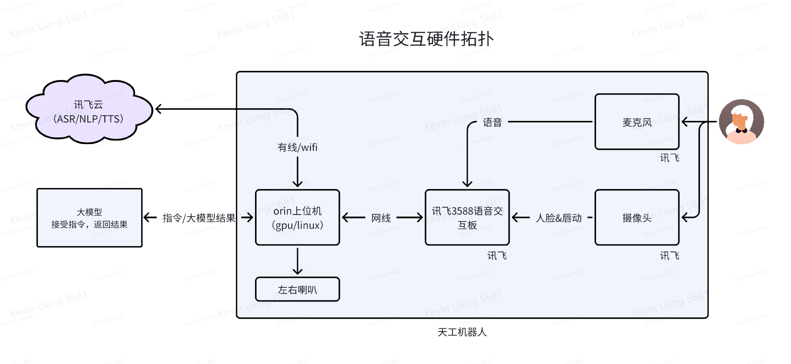

# robot_voice
## robot_voice是Huisikaiwu Agent SDK中负责语音交互的模块，包括语音识别、语音合成、语音播报
- 基于讯飞语音套件进行开发，支持语音识别和语音合成， 用于智能体的语音交互。

## 语音交互硬件拓扑图


## 启动语音
1. 启动ros环境
```bash
# 启动语音ros
source /home/${USER}/audio_ws/devel/setup.bash && roslaunch xunfei_dev_socket xunfei_dev_all.launch
# 看到 recive handshake msg 即成功
# 注意：全局只能有一个语音ros窗口，互斥
```

2. 创建并激活虚拟环境
```bash
# 需要3.8及以上，注意，如果是ROS1环境，只能用python3.8
python3 -c 'import sys; exit(0 if sys.version_info >= (3,8) else 1)' && echo "OK" || echo "Need Python >= 3.8"
cd robot_voice
python3 -m venv .venv
source .venv/bin/activate
```
3. 安装依赖
```bash
pip install -r requirements.txt
```
4. 启动语音服务
- 基于ros1 的语音服务
```bash
python3 server.py
```
- 基于ros2 的语音服务
```bash
python3 server_ros2.py
```
- 不需要语音识别，只做语音合成和播报tts服务
```bash
python3 server_tts_without_ros.py
```
- 如过不是在机器人orin上运行，或者没装ros环境，可通过命令行输入指令（跳过麦克风），用于快速测试
```bash
python3 fake_server.py
```

5. 启动kaiwu_agent，连接以下语音服务
- robot_voice通过websocket协议，对外提供以下语音服务
  - 语音识别（ASR，语音转文本）: 客户端通过websocket连接到 `ws://localhost:8765:voice`，这是持久化连接，你将收到robot_voice广播出来的json str格式的消息
    - `{'instruction': '语音文本', ...}`
  - 语音合成并播报（TTS，语音合成）：客户端通过websocket连接到 `ws://localhost:8765:ttsplay`，把json str格式的消息发给robot_voice
    - `{'text': '你要播报的文本', 'cmd': 'append 或 stop，两种播报模式，等待前面语音播报完成或立刻打断前面的语音', ...}`
    - 注意发送完成后不要主动断开websocket连接，应等待服务端消息，服务端接收完成会主动断开连接，然后客户端再退出